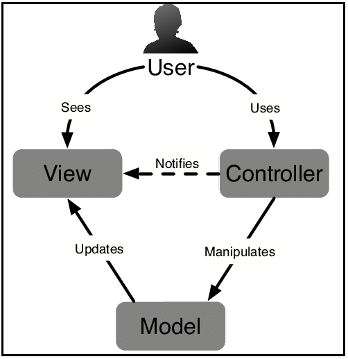
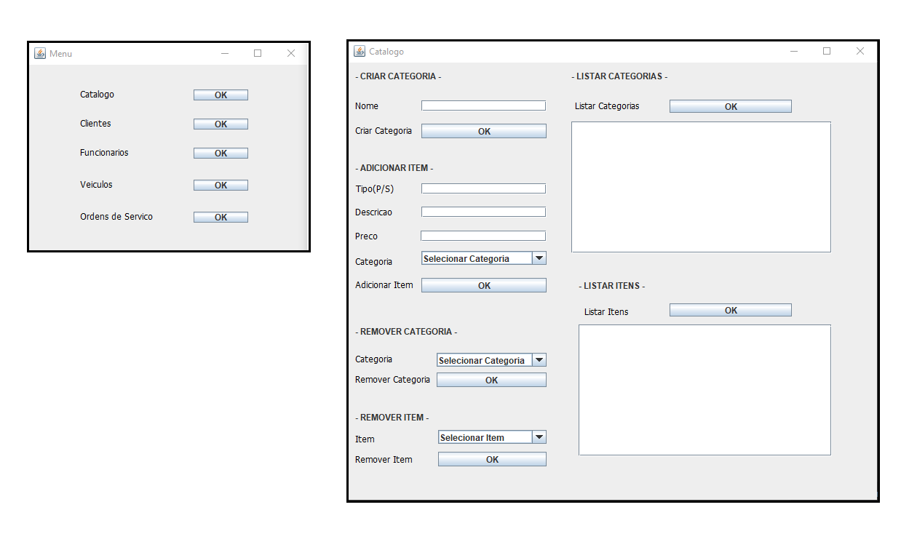

## Application using the MVC Architecture

### What it does?
This work presents an implementation of the MVC (model-view-controller) software architecture, using a car repair agency as the application's domain.

### MVC Architecture


### Application


> **NOTE**
> The application was primarily aimed to portuguese speakers, so the GUI and the code have a lot of portuguese words and phrases.


### How to run?
- Clone the Repository
    ```bash
    $ git clone https://github.com/alexandreclem/MVCapplication.git
    ```
- Compile - creates the binaries (.class)
    
    - Within the **src** directory, run: 
        ```bash
        $ javac -d ../bin ./model/*.java
        $ javac -cp ../bin -d ../bin ./controller/*.java ./persistence/*.java
        $ javac -cp ../bin -d ../bin ./view/*.java
        $ javac -cp ../bin -d ../bin ./main/*.java        
        ```
    - A new directory **bin** with all compiled files will be created inside the project **root** directory

- Execute
    - Within the **src** directory, run: 
        ```bash    
        $ java -cp ../bin main.Main
         ```
- The **data** directory:
    - This folder stores the application persisted data (serialized objects)

> **NOTE**
> All the files are already compiled and ready to execution, moreover, is presented a previously created data.bin for tests. That is, you can test the application just by doing the "Execute" phase from the last section.
